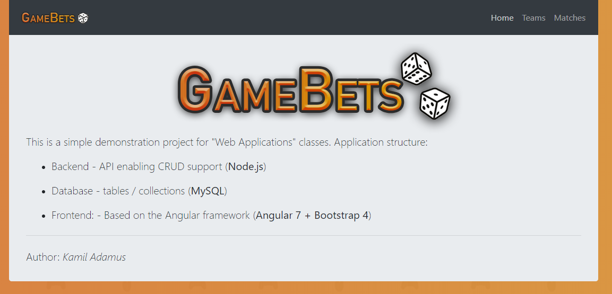
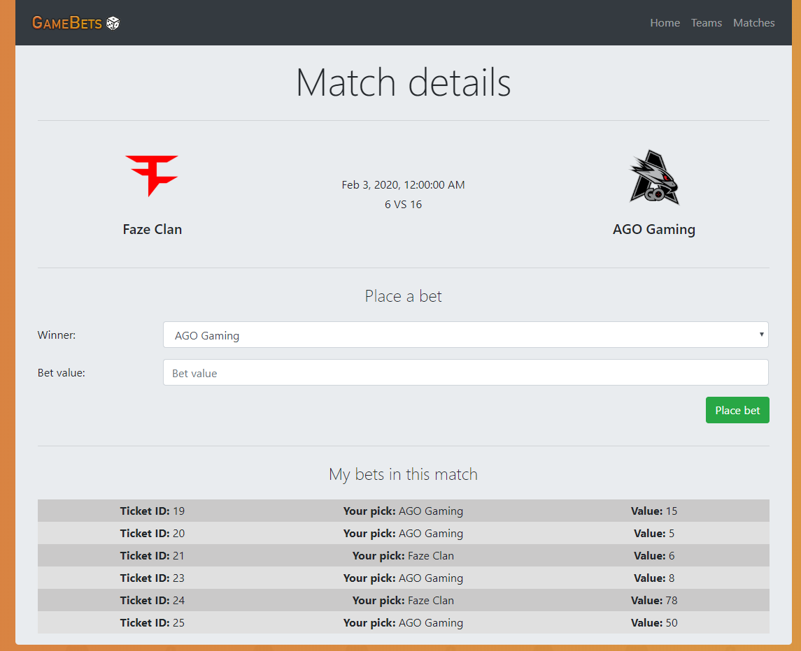
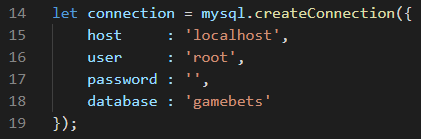

# GameBetsApp

My first attempt with Angular framework after ['Tour of Heroes'](https://angular.io/tutorial) tutorial. Also my first CRUD application in node.js with my own REST API. Orignally created for "Web Applications" classes.

## About project

In application user can choose winner of certain match. He can add, remove and modify teams. Matches can be only added via MySQL. After placing a bet data is stored in localstorage instead of database, becouse application is very simple and is missing authentication feature. Also some logic is missing such disable placing bets on match that already was played.


**Figure 1** - Home page


**Figure 2** - Deleting team


**Figure 3** - Adding new team


**Figure 4** - Example match page

## Getting Started

### Prerequisites

* [Angular 7](https://angular.io/)
* [node.js](https://nodejs.org/en/)
* [mySQL](https://www.mysql.com/)

### Installing

Run server (for example XAMPP)

Import database from file `gamebets.sql` to MySQL

Change connection options in `server.js` file if needed:



Init packages

```
npm install
```

Run backend API - `server.js`

```
nodemon server.js
```

Run Angular application

```
ng serve
```

Navigate to `http://localhost:4200/`

## Built With

* [Angular 7](https://angular.io/) - Frontend
* [node.js](https://nodejs.org/en/) - REST API
* JavaScript (ES5+)
* HTML
* CSS
* [Font Awesome](https://fontawesome.com/) - Icons
* [Bootstrap 4](https://getbootstrap.com/) - Stylize and responsive CSS

## Author

* **Kamil Adamus** - [Prajns](https://github.com/prajns)

## License

This project is licensed under the MIT License